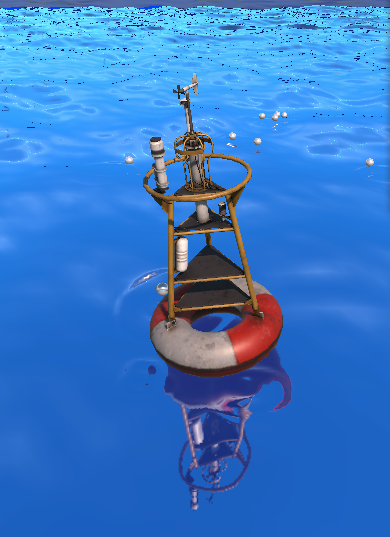
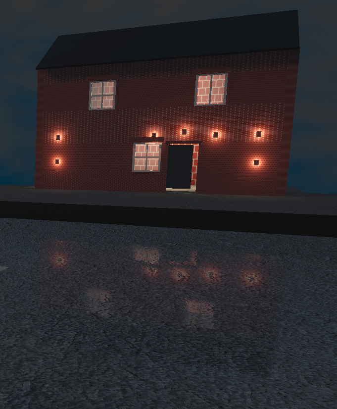

# Planar Mirror Surface (URP) — Optimised Planar Reflections

📚 Documentation (Wiki): https://github.com/saimgulay/Unity-PlanarMirrorReflection/wiki

Self-contained planar reflection system for **Unity URP** using a **secondary reflection Camera** + a dedicated **planar reflection shader**.

- Component: `PlanarMirrorSurface` (C#)
- Shader: `EndlessOcean/URP/MirrorSurfaceSRP_RayPlane`

> Designed for clean integration in real projects: visibility gating, frame-skipping, distance culling, RT stability (lock/hysteresis), and an optional player-centric radius mask.

---

## Preview

          

---

## Contents / Project Layout

This repository/project is organised as:

- `Assets/Scripts/`
  - `PlanarMirrorSurface.cs` — main component (reflection camera, RT, MPB pushes)
- `Assets/Shaders/`
  - `MirrorSurfaceSRP_RayPlane.shader` — planar reflection + URP PBR blend
- `Assets/Materials/`
  - Mirror materials using the shader
- `Assets/Scenes/`
  - Example scenes (recommended: keep a small demo scene here)
- `Assets/Settings/`
  - URP assets / renderer settings (project dependent)
- `Images/`
  - README screenshots / promo images

---

## Requirements

- Unity with **Universal Render Pipeline (URP)** enabled
- A scene camera rendered by URP
- A reflective mesh (plane / quad / any mesh with a renderer)

> The system calls `UniversalRenderPipeline.RenderSingleCamera(...)` and hooks into `RenderPipelineManager.beginCameraRendering`.

---

## Quick Start

1. **Add the component**
   - Add `PlanarMirrorSurface` to the reflective object (the object must have a `Renderer`).

2. **Assign the mirror material**
   - Use shader: `EndlessOcean/URP/MirrorSurfaceSRP_RayPlane`
   - Apply the material to the same renderer as the script.

3. **Layer safety (important)**
   - Put the mirror object on a dedicated layer (e.g. `Mirror`).
   - In `PlanarMirrorSurface.reflectionCullingMask`, **exclude** that layer to avoid recursive feedback.

4. **Play**
   - The component creates a hidden reflection camera, renders into a RenderTexture, and pushes:
     - `_MirrorTex`, `_PlanePosWS`, `_PlaneNormalWS`, `_MirrorVP`
     - optional radius mask params: `_PlayerPosWS`, `_Radius`, `_RadiusFeather`

---

## How It Works (High Level)

- On each URP camera render, the component:
  1. Checks visibility/distance/update-rate.
  2. Ensures a hidden reflection camera exists.
  3. Allocates or reuses a RenderTexture (with lock/hysteresis options).
  4. Reflects the view matrix around the mirror plane.
  5. Applies an oblique clip plane to remove artifacts.
  6. Renders the scene once into `_MirrorTex`.
  7. Sets per-renderer properties via `MaterialPropertyBlock`.

- The shader:
  - Computes a world-space reflection ray and intersects it with the mirror plane.
  - Projects the hit point using `_MirrorVP` into reflection UV.
  - Optionally distorts by normal map.
  - Blends planar reflection with URP PBR lighting (LERP / SCREEN / ADD).
  - Optionally masks reflection by a **player-centric radius disc** on the mirror plane.

---

## Component Reference — `PlanarMirrorSurface`

### Plane Orientation
- **Ground_UseUp (default)**: uses `transform.up` (backwards compatible)
- **Wall_UseForward**: uses `transform.forward` (vertical mirrors)
- **CustomNormal**: uses `customNormalWS` (world space)

### Quality
- `resolutionScale` (0.25–2.0): reflection RT size relative to the source camera
- `msaa` (1–8): MSAA samples for reflection RT (1 disables)
- `allowHDR`: uses HDR RT format when enabled

### Projection
- `clipPlaneOffset`: pushes clip plane to avoid acne
- `matchSourceProjection`: mirrors FOV/ortho parameters from the source camera

### Culling & Layers
- `reflectionCullingMask`: layers rendered in reflection
- `disableShadowsInReflection`: disables shadow rendering for performance (URP additional camera data)

### Performance
- `requireVisibility`: only render if mirror renderer is visible to the current camera
- `updateEveryNFrames`: render frequency (1 = every frame)
- `maxRenderDistance`: skip rendering when far away (0 = disabled)

### Player Radius Mask (optional)
- `player`: transform used as mask centre (null -> world origin)
- `radius`: **<= 0 disables mask (identical behaviour)**; > 0 enables disc mask
- `radiusFeather`: smooth falloff width

### RT Stability
- `lockRtSize`: prevents frequent reallocations by forcing fixed RT size
- `lockedWidth / lockedHeight`: fixed RT dimensions when locked
- `resizeHysteresis`: when unlocked, reallocate only if the resolution change exceeds this ratio

---

## Shader Reference — `MirrorSurfaceSRP_RayPlane`

### Key Material Controls
- **Tint**: `_Tint` (RGBA, alpha drives blending)
- Base map: `_BaseMap`
- Normals:
  - `_NormalMap`, `_NormalScale`
  - `_UseRGPacked` if normal is not imported as Unity normal
- Height/parallax: `_HeightMap`, `_HeightScale` (base only)
- AO: `_OcclusionMap`, `_OcclusionStrength`
- PBR: `_Metallic`, `_Smoothness`
- Reflection:
  - `_Reflectiveness`, `_FresnelPower`
  - `_DistortionStrength` (normal-based UV warp)
  - `_ReflectionBlend` (0=LERP, 1=SCREEN, 2=ADD)
- Ambient diffuse (optional): `_AmbientDiffuse` (0..1 SH contribution)

### Script-Driven Properties (do not edit manually)
- `_MirrorTex` — reflection RT
- `_PlanePosWS`, `_PlaneNormalWS` — mirror plane definition
- `_MirrorVP` — reflection camera VP matrix
- `_PlayerPosWS`, `_Radius`, `_RadiusFeather` — optional radius mask

---

## Recommended Setup Tips

- **Exclude the mirror layer** from `reflectionCullingMask` to prevent infinite recursion.
- For best performance:
  - `requireVisibility = true`
  - `updateEveryNFrames = 2` (or more) for large scenes
  - `disableShadowsInReflection = true` if acceptable
  - Use `lockRtSize` for stable GPU memory usage (e.g. 1024×1024 / 2048×2048)
- For vertical mirrors (walls), set `planeMode = Wall_UseForward`.

---

## Known Limitations

- Planar reflections are view-dependent and limited to a plane; this is not SSR.
- Multiple mirrors in view can multiply cost (each creates its own reflection render).
- Very large distortion values can sample outside the reflection RT (clamped wrap mode).
- Transparent objects and certain post effects may not match perfectly (depends on URP configuration).

---

## Troubleshooting

**Reflection is black**
- Confirm URP is active and the object uses the provided shader.
- Confirm the reflection camera renders something (culling mask not empty).
- Ensure the mirror object isn’t being rendered in the reflection (exclude layer).

**Feedback / “hall of mirrors”**
- Exclude the mirror layer from `reflectionCullingMask`.

**Flickering RT allocations**
- Enable `lockRtSize` or increase `resizeHysteresis`.

**Artifacts near plane**
- Adjust `clipPlaneOffset` slightly (e.g. 0.02–0.1).

---

## License

MIT License. See [LICENSE](LICENSE).

## Credits

Developed by: @saimgulay
